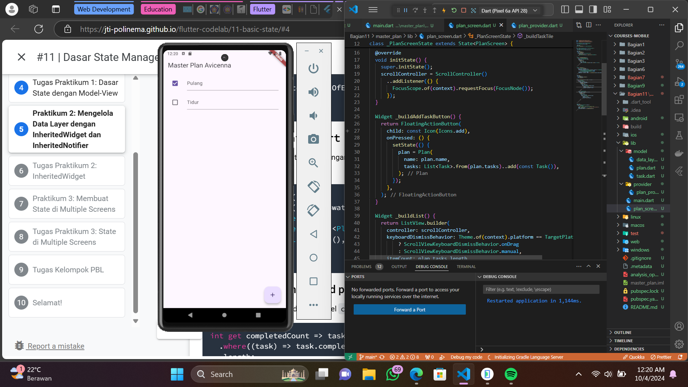
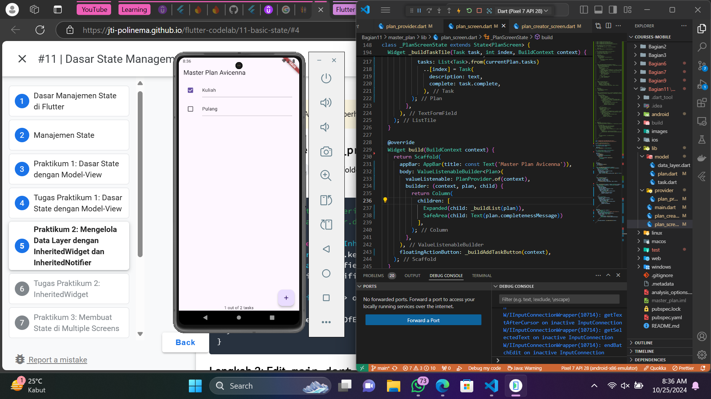
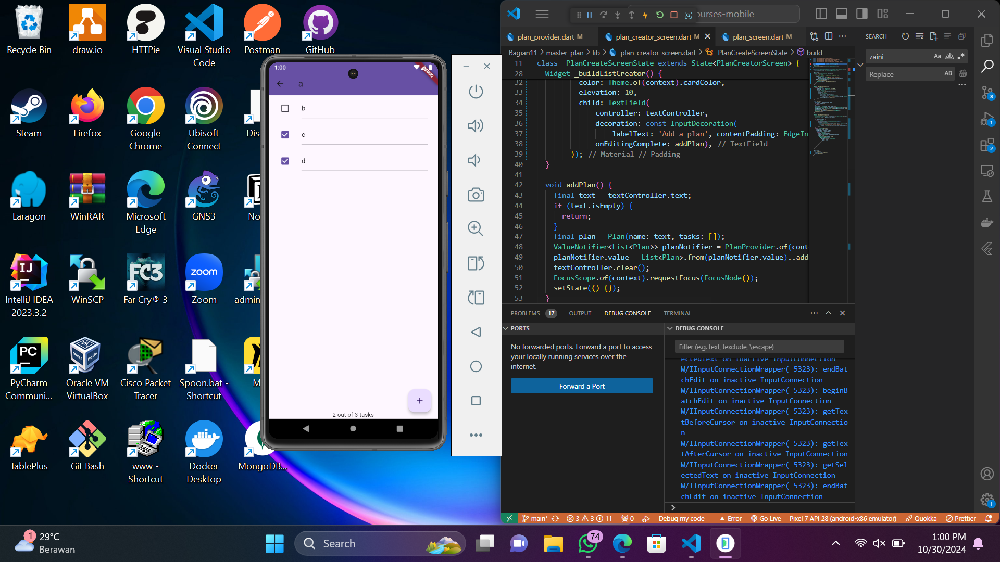
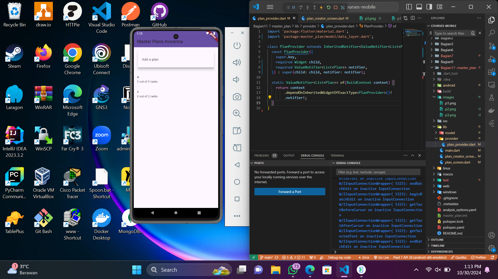

# master_plan

## Tugas Praktikum 1: Dasar State dengan Model-View

Selesaikan langkah-langkah praktikum tersebut, lalu dokumentasikan berupa GIF hasil akhir praktikum beserta penjelasannya di file README.md! Jika Anda menemukan ada yang error atau tidak berjalan dengan baik, silakan diperbaiki.

Jelaskan maksud dari langkah 4 pada praktikum tersebut! Mengapa dilakukan demikian? Karena models terdiri atas beberapa file jadi dilakukan import melalui 1 file lain supaya tidak perlu import semua models satu persatu.

Mengapa perlu variabel plan di langkah 6 pada praktikum tersebut? Mengapa dibuat konstanta ? Variabel tersebut digunakan untuk menyimpan data bertipe Object Plan, const berarti variabel tersebut sama sekali tidak bisa dan tidak boleh diubah setelahnya.

Lakukan capture hasil dari Langkah 9 berupa GIF, kemudian jelaskan apa yang telah Anda buat! Saya telah membuat 1 layar sederhana memiliki 1 floating button untuk menambah task dan menampilkannya dalam daftar task.

Apa kegunaan method pada Langkah 11 dan 13 dalam lifecyle state ? initState hanya akan dijalankan ketika widget dibuild dan dispose ketika widget tersebut dihapus.

Kumpulkan laporan praktikum Anda berupa link commit atau repository GitHub ke spreadsheet yang telah disediakan!

## Tugas Praktikum 2: Inherited Widget

Selesaikan langkah-langkah praktikum tersebut, lalu dokumentasikan berupa GIF hasil akhir praktikum beserta penjelasannya di file README.md! Jika Anda menemukan ada yang error atau tidak berjalan dengan baik, silakan diperbaiki sesuai dengan tujuan aplikasi tersebut dibuat.

Jelaskan mana yang dimaksud InheritedWidget pada langkah 1 tersebut! Mengapa yang digunakan InheritedNotifier? PlanProvider mengextends Inherit Widget untuk membuat widget yang bisa menyalurkan data ke child tanpa perlu meneruskan satu demi satu data melalui konstruktor. InheritedNotifier sesuai namanya, digunakan sebagai notifier/pemberitahuan yang berperan untuk memberitahu semua widget yang mendengarkannya saat nilai dalam ValueNotifier berubah.

Jelaskan maksud dari method di langkah 3 pada praktikum tersebut! Mengapa dilakukan demikian? Fungsi completedCount digunakan untuk mengembalikan nilai integer yang menunjukkan berapa banyak tugas yang telah selesai. Sedangkan completenessMessage digunakan untuk menampilkan string jumlah task yang selesai dari jumlah seluruh task yang ada.

Lakukan capture hasil dari Langkah 9 berupa GIF, kemudian jelaskan apa yang telah Anda buat! Saya telah membuat fitur tambahan yakni menampilkan jumlah task yang selesai dari jumlah keseluruhan task.

Kumpulkan laporan praktikum Anda berupa link commit atau repository GitHub ke spreadsheet yang telah disediakan!

## Tugas Praktikum 3: State di Multiple Screens

Selesaikan langkah-langkah praktikum tersebut, lalu dokumentasikan berupa GIF hasil akhir praktikum beserta penjelasannya di file README.md! Jika Anda menemukan ada yang error atau tidak berjalan dengan baik, silakan diperbaiki sesuai dengan tujuan aplikasi tersebut dibuat.

Berdasarkan Praktikum 3 yang telah Anda lakukan, jelaskan maksud dari gambar diagram berikut ini! Gambar tersebut berisi struktur widget yang kita gunakan dalam praktikum kali ini, Navigator.push() menghubungkan halaman PlanCreatorScreen dengan PlanScreen.

Lakukan capture hasil dari Langkah 14 berupa GIF, kemudian jelaskan apa yang telah Anda buat! Saya telah membuat halaman baru untuk menambahkan plan yang di dalamnya bisa terdiri atas banyak tugas seperti 2 gambar berikut.

Kumpulkan laporan praktikum Anda berupa link commit atau repository GitHub ke spreadsheet yang telah disediakan!

## Getting Started

This project is a starting point for a Flutter application.

A few resources to get you started if this is your first Flutter project:

- [Lab: Write your first Flutter app](https://docs.flutter.dev/get-started/codelab)
- [Cookbook: Useful Flutter samples](https://docs.flutter.dev/cookbook)

For help getting started with Flutter development, view the
[online documentation](https://docs.flutter.dev/), which offers tutorials,
samples, guidance on mobile development, and a full API reference.
