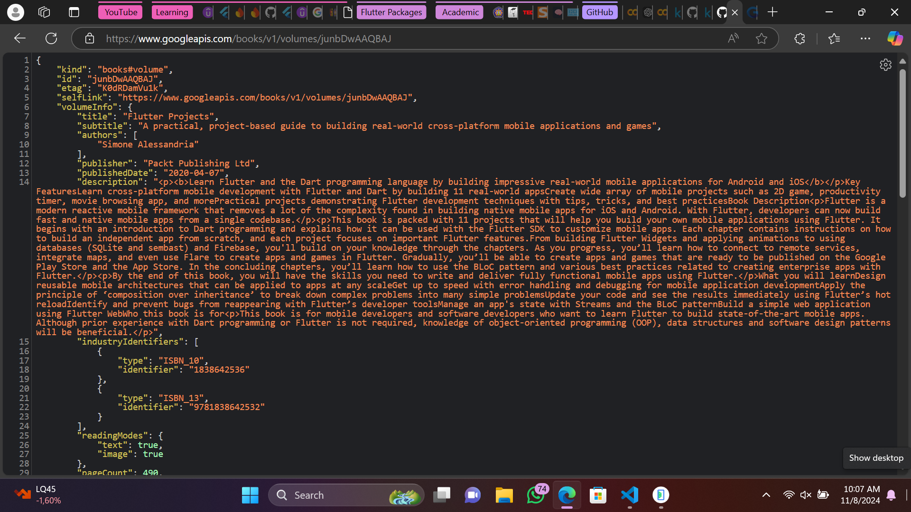
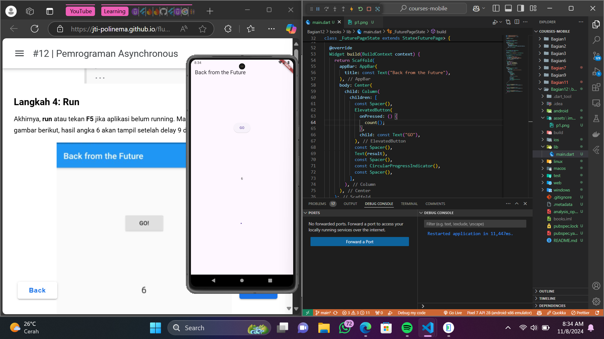
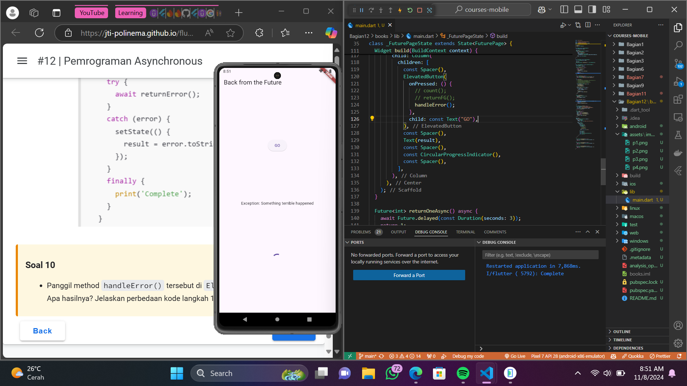
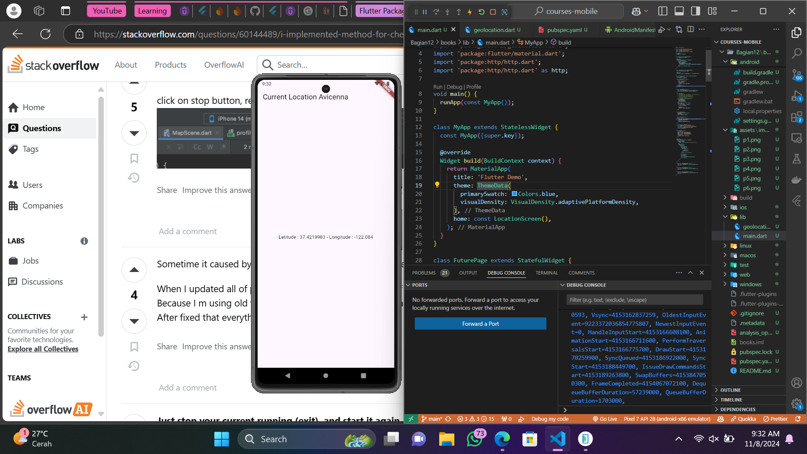
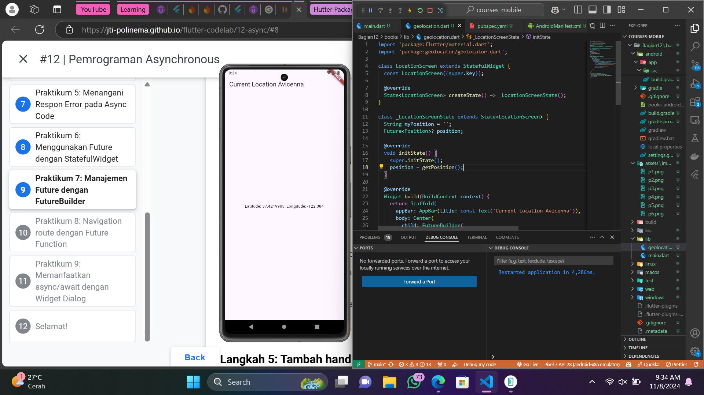
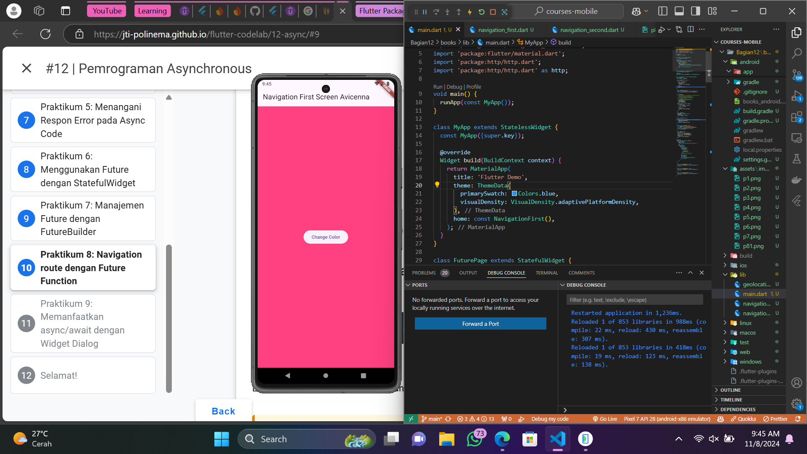

# books

A new Flutter project.

## Soal 1
Nama disisipkan appbar melalui kode berikut.
```
  @override
  Widget build(BuildContext context) {
    return Scaffold(
      appBar: AppBar(
        title: const Text("Back from the Future Avicenna"),
      ),
      body: Center(
        child: Column(
          children: [
```

## Soal 2


## Soal 3
Fungsi substring digunakan untuk mengambil karakter dari indeks 0-450 dalam String tsb.

## Soal 4
Kode tsb berisi 3 fungsi yang asinkron masing-masing mengembalikan angka 1, 2, dan 3 setelah menunggu 3 detik. Fungsi count menjumlahkan hasil dari semua fungsi tersebut secara berurutan, sehingga total waktu yang dibutuhkan adalah 9 detik. Setelah mendapatkan total yakni 6, fungsi tsb memperbarui variabel result menggunakan setState.

## Soal 5
Completer digunakan untuk mengelola operasi asinkron. Fungsi getNumber memulai perhitungan memerlukan waktu selama 5 detik dan memberikan hasil 42 melalui Completer setelah selesai.

## Soal 6
Perbedaan terletak pada penanganan error, langkah 2 tidak ada error handling, sedangkan langkah 5 dan 6 melakukan handling terhadap error dengan fungsi catchError().

## Soal 7


## Soal 8
FutureGroup berguna untuk mengelompokkan beberapa futures dan mengelolanya secara terpisah. Future.wait digunakan untuk mengambil daftar futures dan mengembalikannya ketika selesai.

## Soal 9


## Soal 10
Fungsi handle error memunculkan Complete di terminal setelah fungsi handle error dieksekusi. Kode pertama menggunakan pendekatan berbasis Future dengan urutan then, catchError, dan whenComplete. Kode kedua menggunakan pendekatan async dan await yang membuat kode lebih mudah dibaca.

## Soal 11
Nama disisipkan appbar melalui kode berikut.
```
  @override
  Widget build(BuildContext context) {
    return Scaffold(
      appBar: AppBar(title: const Text('Current Location Avicenna')),
      body: Center(
        child: FutureBuilder(
```

## Soal 12
Bisa apabila diizinkan untuk akses lokasi.


## Soal 13
Icon loading dimunculkan ketika reload sebagai tanda bahwa proses sedang berjalan, data sedang dalam perjalanan.


## Soal 14
Perbedaan hanya terlihat ketika mengalami error dan memunculkan teks "Something terrible happened!".


## Soal 15
Nama disisipkan appbar melalui kode berikut.
```
  @override
  Widget build(BuildContext context) {
    return Scaffold(
      backgroundColor: color,
      appBar: AppBar(
        title: const Text('Navigation First Screen Avicenna'),
      ),
      body: Center(
```

## Soal 16
Navigationscreen first muncul, setelah click change color dan memilih button sesuai colornya maka akan meneruskan value color yang ada di button tersebut untuk menggantikan warna sebelumnya.



## Soal 17
Navigationscreen muncul, setelah click change color akan terlihat pop-up dialog dan memilih button sesuai color maka akan meneruskan value color yang ada di button tersebut untuk menggantikan warna sebelumnya.

## Getting Started
This project is a starting point for a Flutter application.

A few resources to get you started if this is your first Flutter project:

- [Lab: Write your first Flutter app](https://docs.flutter.dev/get-started/codelab)
- [Cookbook: Useful Flutter samples](https://docs.flutter.dev/cookbook)

For help getting started with Flutter development, view the
[online documentation](https://docs.flutter.dev/), which offers tutorials,
samples, guidance on mobile development, and a full API reference.
