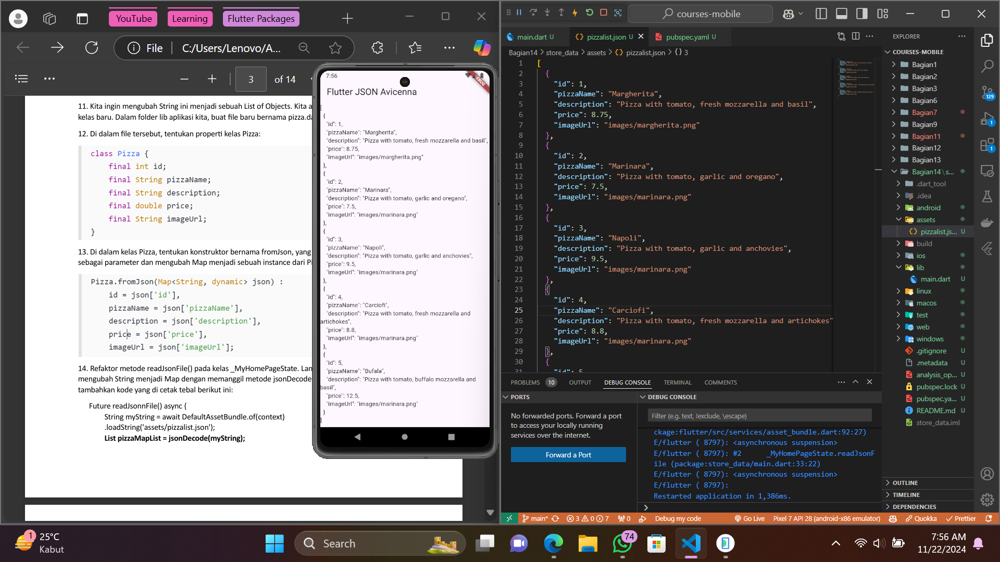
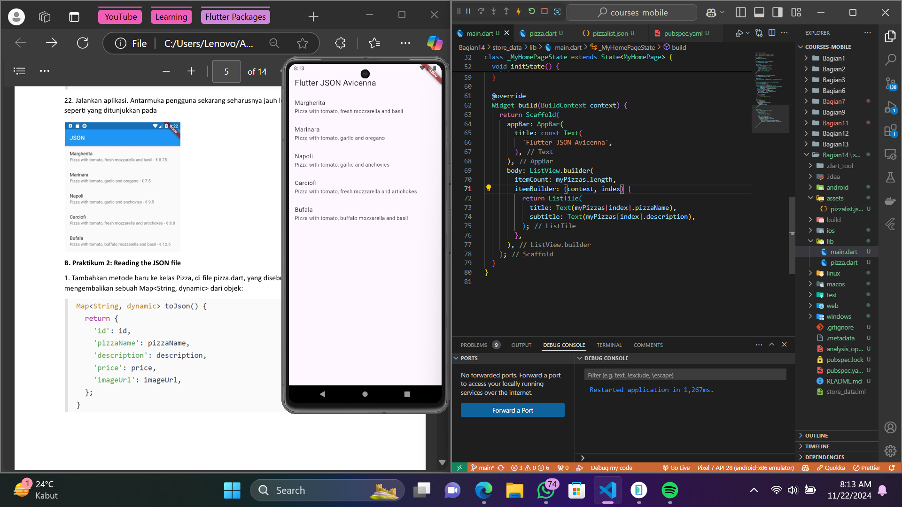
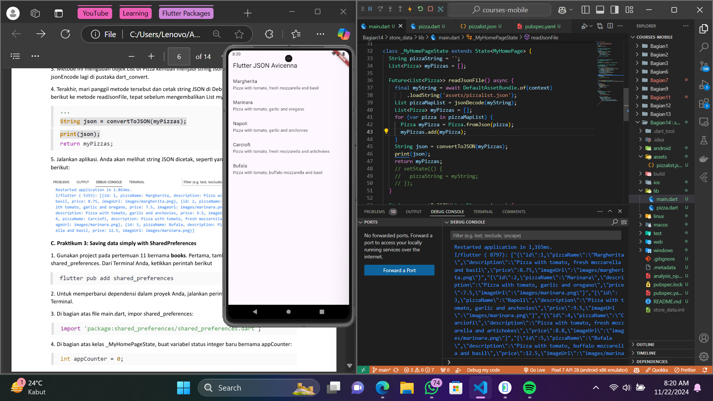
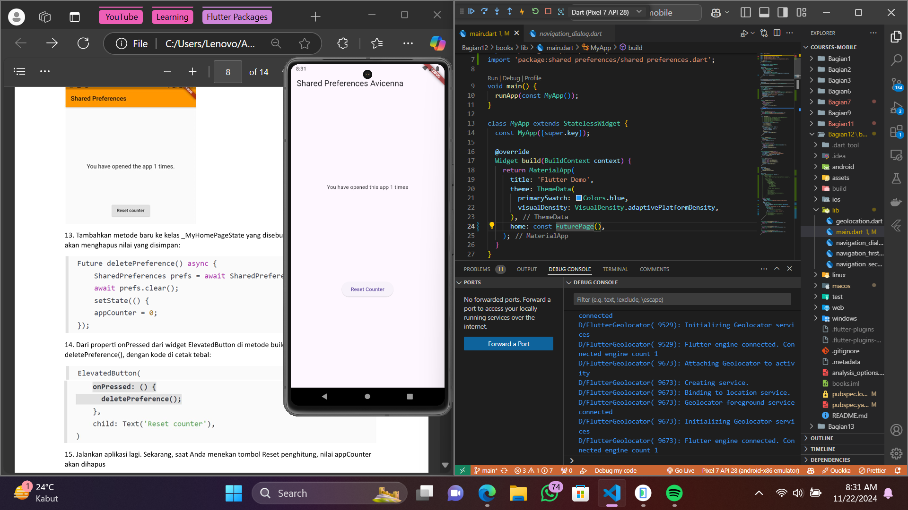
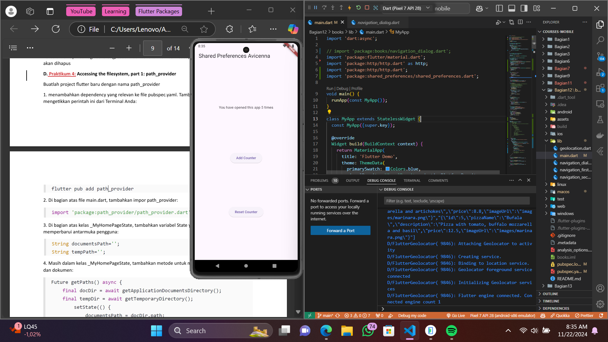
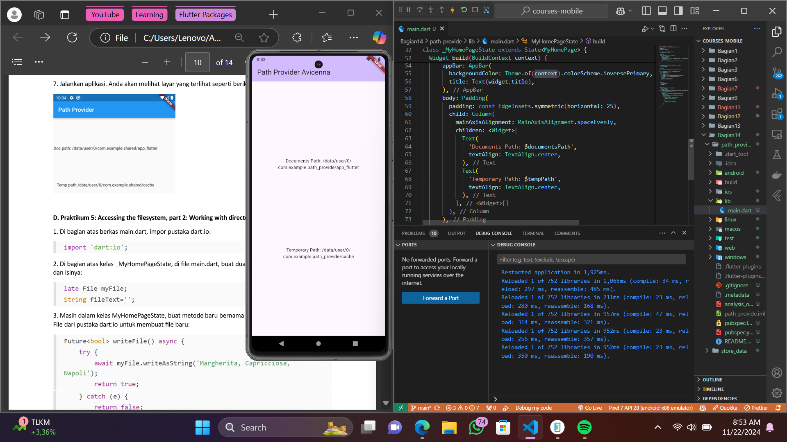

A new Flutter project.

## Praktikum 1

Di praktikum ini saya belajar untuk membaca file json dan kemudian menampilkannya di layar menggunakan fungsi readJsonFile().

Setelah json berhasil tampil, kemudian saya membuat model untuk mapping data berupa json yang diterima tadi dan ditampilkan lagi dengan hasil yang lebih rapi.

## Praktikum 2

Di sini saya berhasil convert data berupa list menjadi map/json menggunakan fungsi convertToJson(), hasilnya tampil pada debug bar karena menggunakan perintah print, tanpa mencetaknya di widget.

## Praktikum 3

Plugin shared_preferences perlu diimport sebagai tempat untuk menyimpan data berupa key dan valuenya (key-value pairs). Value yang disimpan bisa berupa string, integer, dan array/list. Di sini kita menyimpan sebuah integer yang memiliki key "appCounter" dan value berisi data integer tersebut.

Seperti pada gambar di atas, saya berhasil menambah fitur reset menggunakan fungsi deletePreference() untuk menghapus semua value yang telah disimpan sebelumnya.

## Praktikum 4

Salah satu plugin populer yang dapat digunakan untuk mendapatkan path file atau direktori adalah path_provider. Di sini saya menggunakannya untuk mendapatkan path direktori document dan path direktori sementara, kemudian menampilkan pathnya di layar seperti pada gambar di atas.

## Praktikum 5

Masih menggunakan path_provider, di sini saya tidak hanya menampilkan pathnya namun juga menggunakannya untuk menyimpan string dalam file pizzas.txt dan mencetak isi dari file tersebut ke layar seperti pada gambar di atas.

## Praktikum 6

Plugin terakhir pada tugas kali ini yaitu flutter_secure_storage, memiliki fungsi yang sama seperti shared_preferences, plugin ini dapat mengamankan isi data didalamnya dengan fitur enkripsi otomatis yang dimilikinya sehingga juga memerlukan key untuk mengubah atau membaca isinya.

## Getting Started
This project is a starting point for a Flutter application.

A few resources to get you started if this is your first Flutter project:

- [Lab: Write your first Flutter app](https://docs.flutter.dev/get-started/codelab)
- [Cookbook: Useful Flutter samples](https://docs.flutter.dev/cookbook)

For help getting started with Flutter development, view the
[online documentation](https://docs.flutter.dev/), which offers tutorials,
samples, guidance on mobile development, and a full API reference.
