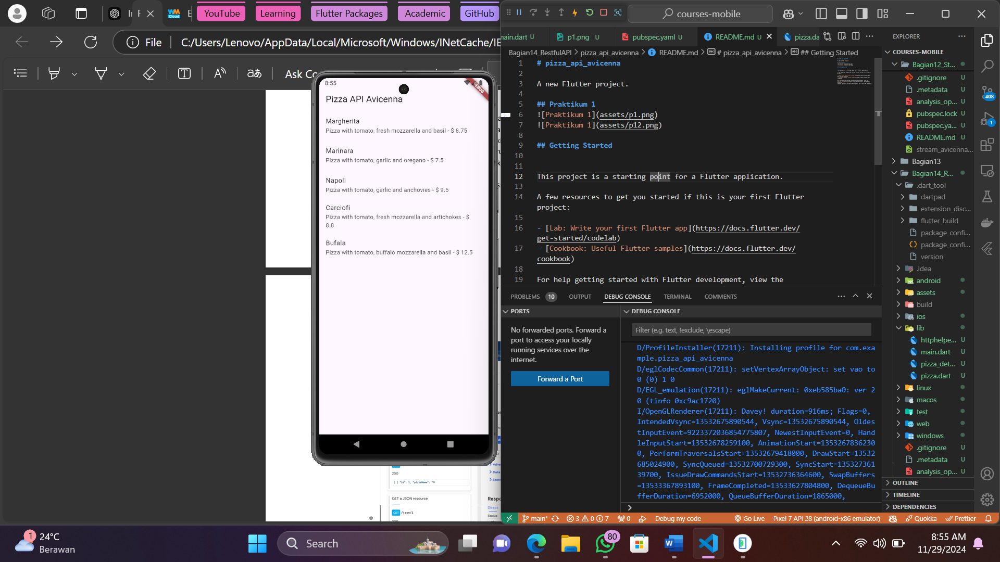

# pizza_api_avicenna

A new Flutter project.

## Praktikum 1

Pertama kita harus mendaftar dan konfigurasi API yang akan diconsume pada web yang telah disediakan seperti pada gambar pertama menggunakan http method get. Kemudan setelah mengikuti semua langkah praktikum, kita bisa menampilkan hasil response dari request yang kita kirim menggunakan http helper ke layar aplikasi seperti pada gambar kedua.

## Getting Started

This project is a starting point for a Flutter application.

A few resources to get you started if this is your first Flutter project:

- [Lab: Write your first Flutter app](https://docs.flutter.dev/get-started/codelab)
- [Cookbook: Useful Flutter samples](https://docs.flutter.dev/cookbook)

For help getting started with Flutter development, view the
[online documentation](https://docs.flutter.dev/), which offers tutorials,
samples, guidance on mobile development, and a full API reference.
