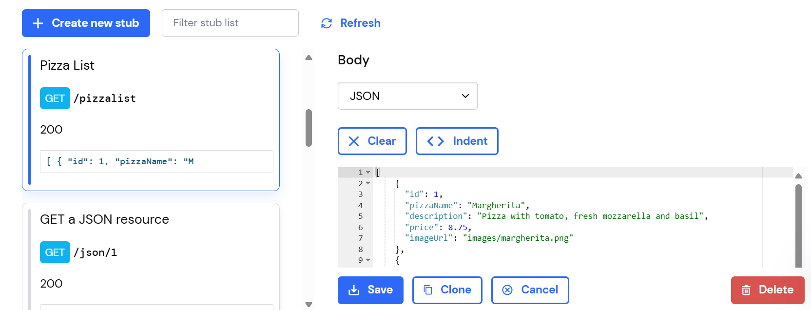
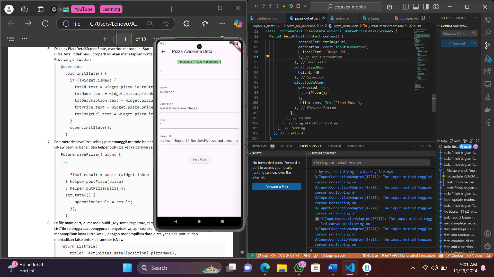

# pizza_api_avicenna

A new Flutter project.

## Praktikum 1

Pertama kita harus mendaftar dan konfigurasi API yang akan diconsume pada web yang telah disediakan seperti pada gambar pertama menggunakan http method get. Kemudian setelah mengikuti semua langkah praktikum, kita bisa menampilkan hasil response dari request yang kita kirim menggunakan http helper ke layar aplikasi seperti pada gambar kedua.

## Praktikum 2

Di praktikum kedua, masih menggunakan API yang sama namun dengan http method yang berbeda, sekarang menggunakan post. Melalui file http helper kita mengirim data yang sudah diisi pada halaman pizza detail untuk kemudian response nya kita tampilkan di atas formulir seperti pada gambar di atas.

## Praktikum 3

Di sini kita menggunakan http method put untuk mengedit atau mengupdate data pada server. Melalui file http helper kita mengirim updated data yang sudah diisi pada halaman pizza detail untuk kemudian response nya kita tampilkan di atas formulir seperti pada gambar di atas.

## Praktikum 4

Terakhir kita menggunakan http method delete sebagai perumpamaan aksi menghapus data pada server. Melalui file http helper kita mengirim id pizza dari salah satu pizza dalam list yang telah kita dismiss pada halaman utama aplikasi seperti gambar di atas.

## Getting Started

This project is a starting point for a Flutter application.

A few resources to get you started if this is your first Flutter project:

- [Lab: Write your first Flutter app](https://docs.flutter.dev/get-started/codelab)
- [Cookbook: Useful Flutter samples](https://docs.flutter.dev/cookbook)

For help getting started with Flutter development, view the
[online documentation](https://docs.flutter.dev/), which offers tutorials,
samples, guidance on mobile development, and a full API reference.
