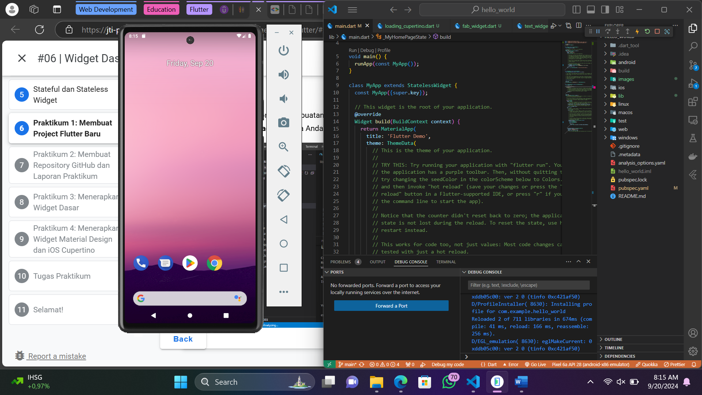
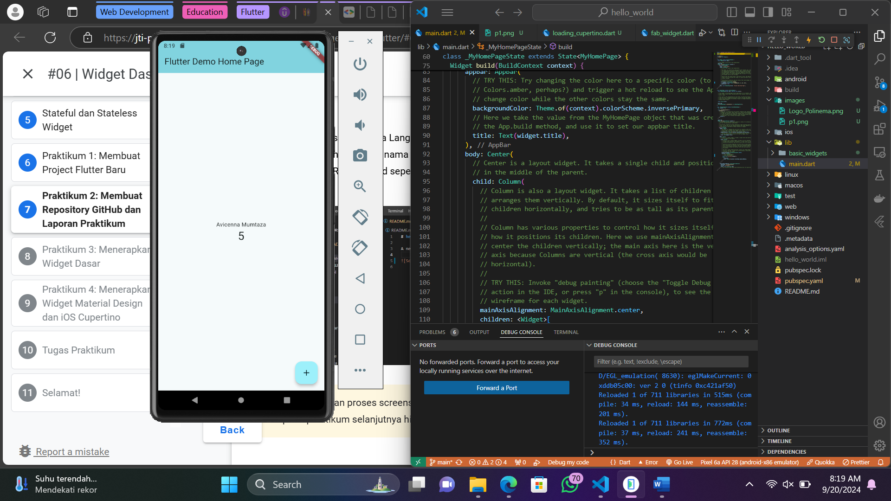
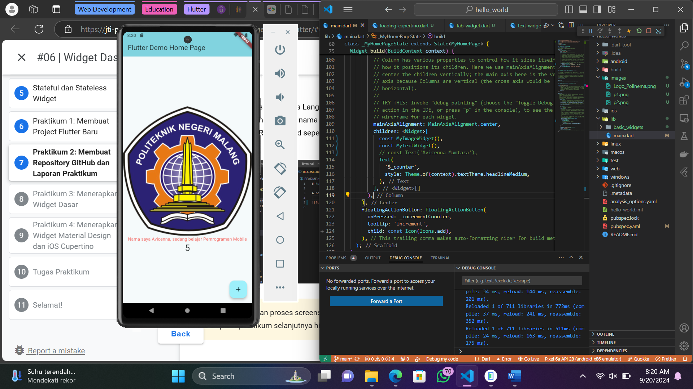
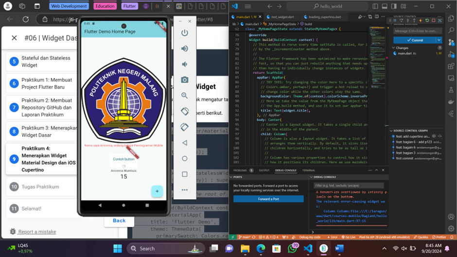
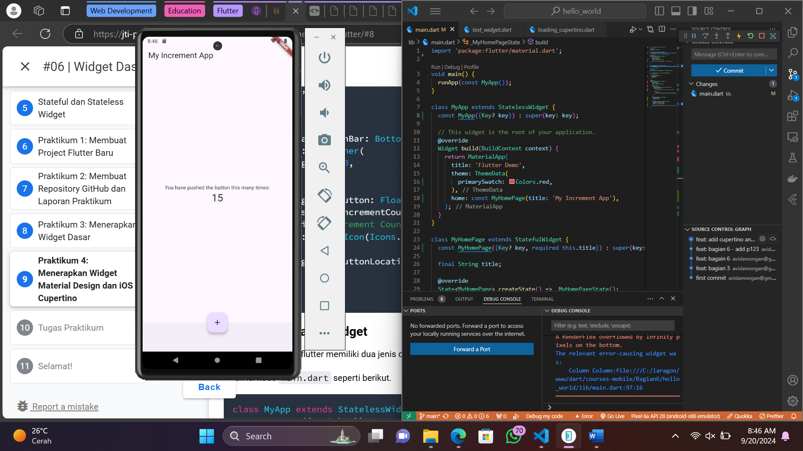
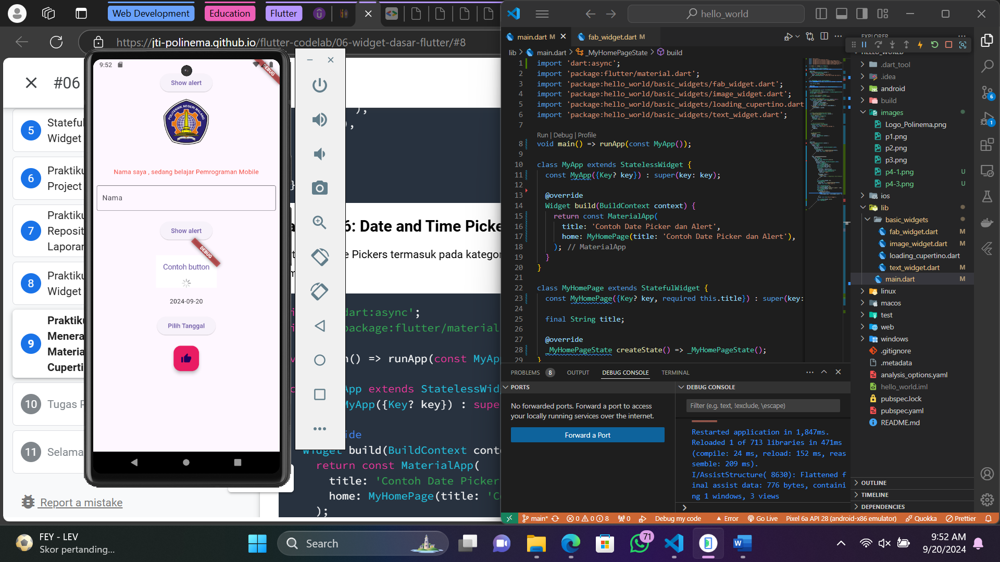

# Hello World Project

## Praktikum 1

Project flutter saya buat dengan mengeksekusi perintah “flutter create (nama-project)” dalam terminal

## Praktikum 2

Text default saya ganti dengan mengubah argument dari method Text() dalam body dengan nama saya.

## Praktikum 3

Logo dan text bisa ditampilkan dengan menambahkan path file dalam pubspec.yaml dan memanggilnya di tempat yang kita inginkan.

## Praktikum 4

Menginput dan mengkombinasikan kode program yang tersedia di gitbook ke dalam project.

## Getting Started
A new Flutter project.

This project is a starting point for a Flutter application.

A few resources to get you started if this is your first Flutter project:

- [Lab: Write your first Flutter app](https://docs.flutter.dev/get-started/codelab)
- [Cookbook: Useful Flutter samples](https://docs.flutter.dev/cookbook)

For help getting started with Flutter development, view the
[online documentation](https://docs.flutter.dev/), which offers tutorials,
samples, guidance on mobile development, and a full API reference.