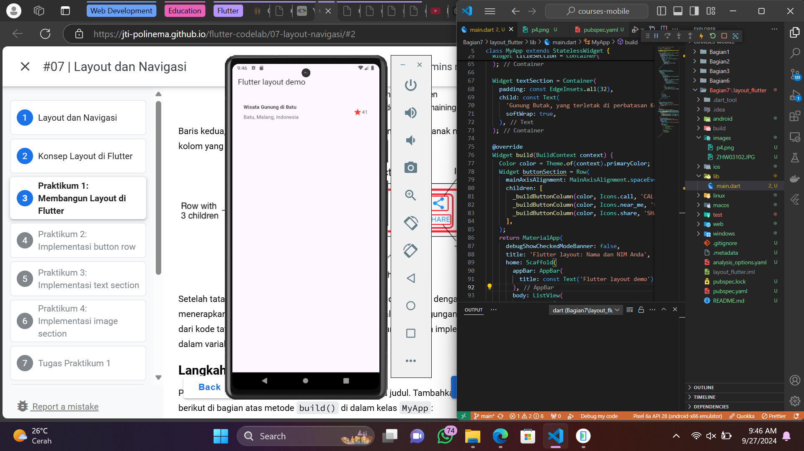
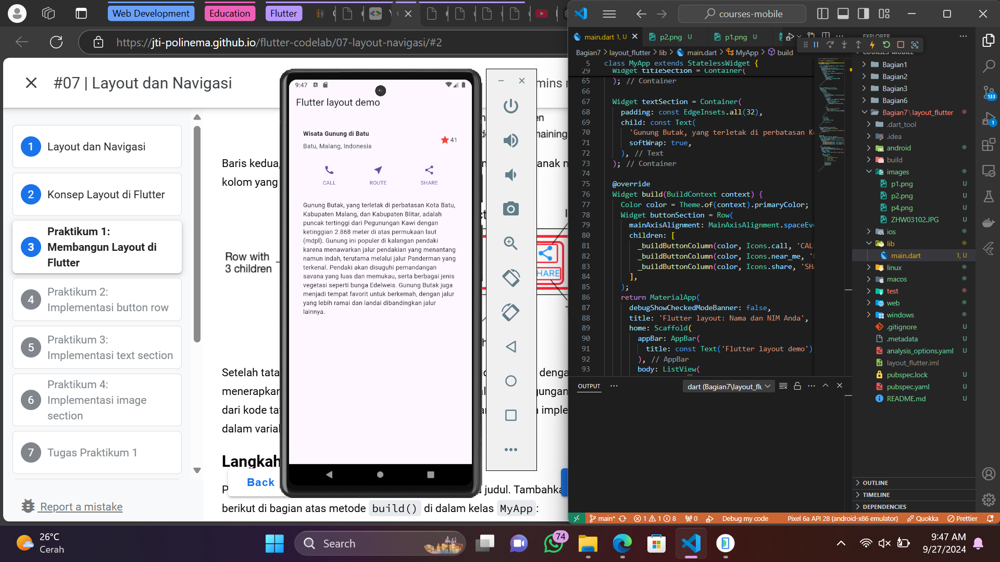
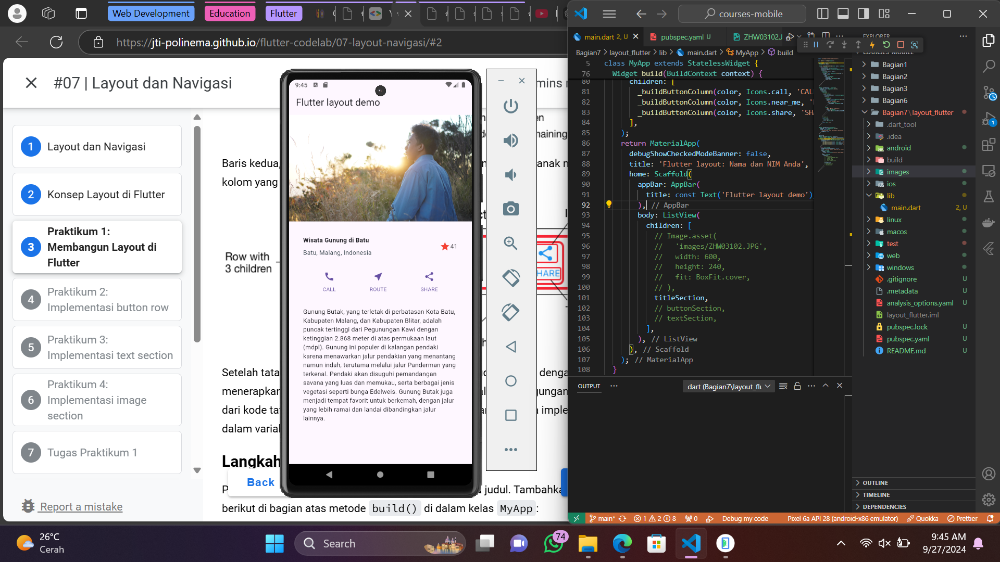

# Hello World Project

## Praktikum 1

Buat widget untuk section title dalam class MyApp. Widget berisi 2 kolom. Kolom kiri berisi 2 teks dalam 2 row dan kolom kanan hanya berisi icon dan textnya.

## Praktikum 2

Buat widget untuk section button dalam class MyApp. Widget berisi 1 row yang di dalamnya ada 3 kolom untuk 3 icon dan textnya.

## Praktikum 3

Widget untuk text hanya berisi 1 text yang memiliki softWrap bernilai true supaya baris text memenuhi lebar device dan membungkusnya pada setiap batas kata.

## Praktikum 4

Widget/section teratas berisi image berisi file gambar dengan width dan height tertentu. Pastikan sudah menambah path gambar pada assets dalam pubspec.yaml

## Getting Started

This project is a starting point for a Flutter application.

A few resources to get you started if this is your first Flutter project:

- [Lab: Write your first Flutter app](https://docs.flutter.dev/get-started/codelab)
- [Cookbook: Useful Flutter samples](https://docs.flutter.dev/cookbook)

For help getting started with Flutter development, view the
[online documentation](https://docs.flutter.dev/), which offers tutorials,
samples, guidance on mobile development, and a full API reference.
