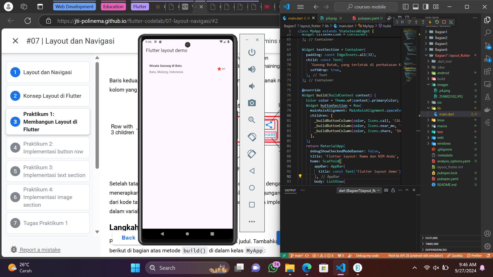
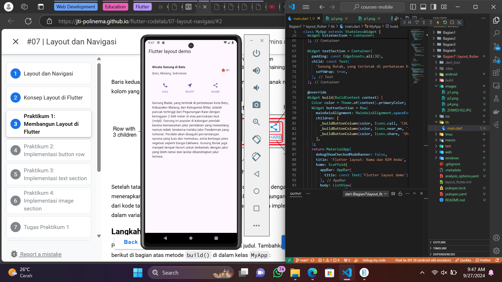
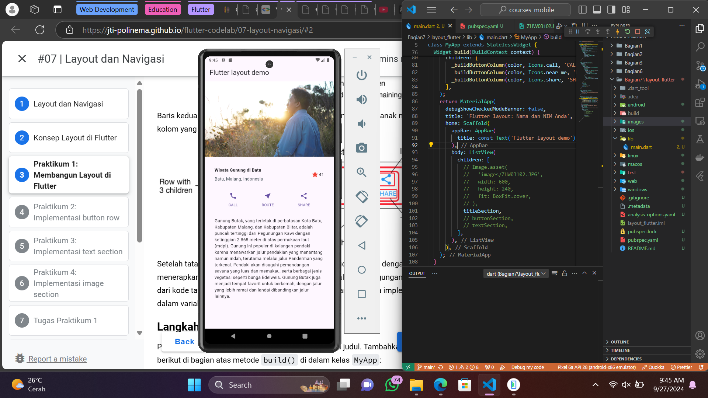
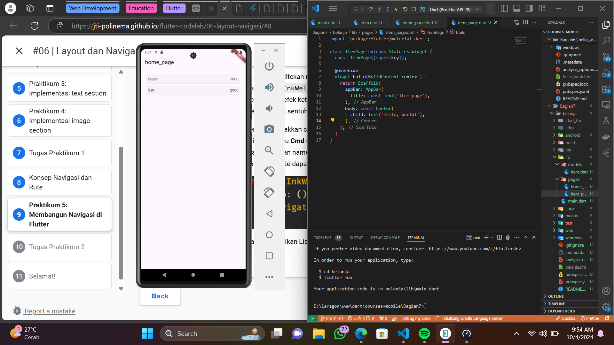
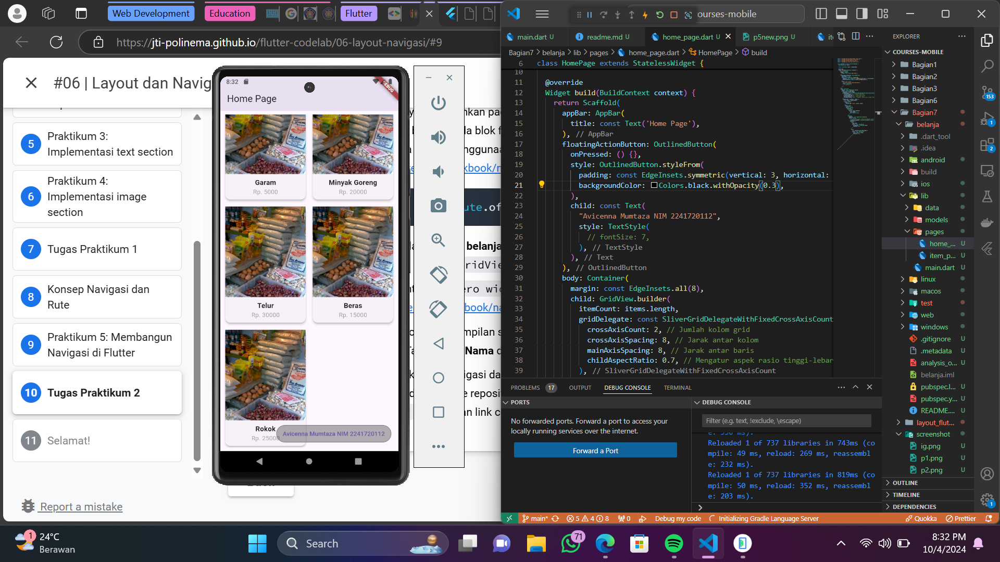

# Hello World Project

## Praktikum 1

Buat widget untuk section title dalam class MyApp. Widget berisi 2 kolom. Kolom kiri berisi 2 teks dalam 2 row dan kolom kanan hanya berisi icon dan textnya.

## Praktikum 2

Widget untuk section button dibuat dalam class MyApp. Widget berisi 1 row yang di dalamnya terdiri dari 3 kolom untuk 3 icon beserta textnya.

## Praktikum 3

Widget untuk text hanya berisi 1 text yang memiliki softWrap bernilai true supaya baris text memenuhi lebar device dan membungkusnya pada setiap batas kata.

## Praktikum 4

Widget/section teratas berisi image berisi file gambar dengan width dan height tertentu. Pastikan sudah menambah path gambar pada assets dalam pubspec.yaml

## Praktikum 5

Ada 2 screen berbasis widget dalam 1 project. Cara untuk mengatur konfigurasi route dapat dilakukan dalam file main.dart agar mempermudah dalam menavigasi screen yang ada. Penggunaan go_route sebagai plugin tambahan juga membantu meningkatkan efisiensi dalam proses configure routing aplikasi.