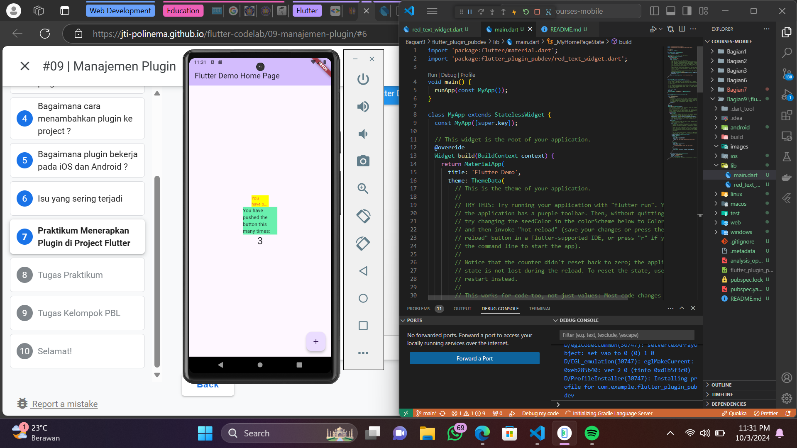

# Hello World Project

## Praktikum

Ada 1 stateless komponen baru yang digunakan dalam kelas main. Komponen tersebut adalah RedTextWidget yang di dalamnya mengandung depencency ke package auto_size_text, itu membuat text yang diterima sebagai argumen akan menyesuaikan ukuran dari batasnya (komponen container). 

Langkah 2: Menginstall plugin auto_size_text supaya dapat digunakan dalam project.

Langkah 5: Menambahkan required parameter dengan nama text bertipe String, sebagai text yang akan ditampilkan dalam widget RedTextWidget.

Langkah 6: Menambahkan 2 container sebagai widget yang akan ditampilkan di main dalam project. Container pertama menampilkan widget RedTextWidget dengan width 50 berwarna yellowAccent dan Container kedua menampilkan widget Text biasa dengan width 100 berwarna greenAccent.

Plugin auto_size_text: Plugin yang digunakan untuk membuat Text yang resize otomatis menyesuaikan batasnya.

A new Flutter project.

## Getting Started

This project is a starting point for a Flutter application.

A few resources to get you started if this is your first Flutter project:

- [Lab: Write your first Flutter app](https://docs.flutter.dev/get-started/codelab)
- [Cookbook: Useful Flutter samples](https://docs.flutter.dev/cookbook)

For help getting started with Flutter development, view the
[online documentation](https://docs.flutter.dev/), which offers tutorials,
samples, guidance on mobile development, and a full API reference.